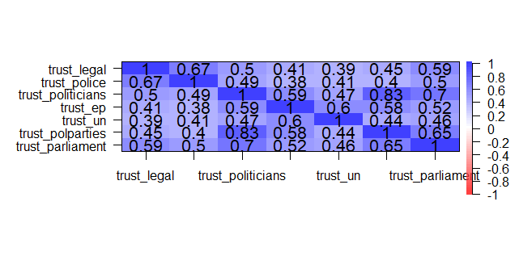
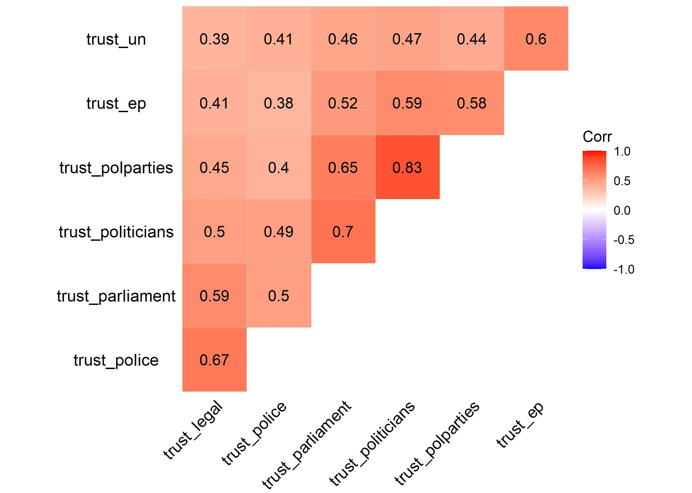
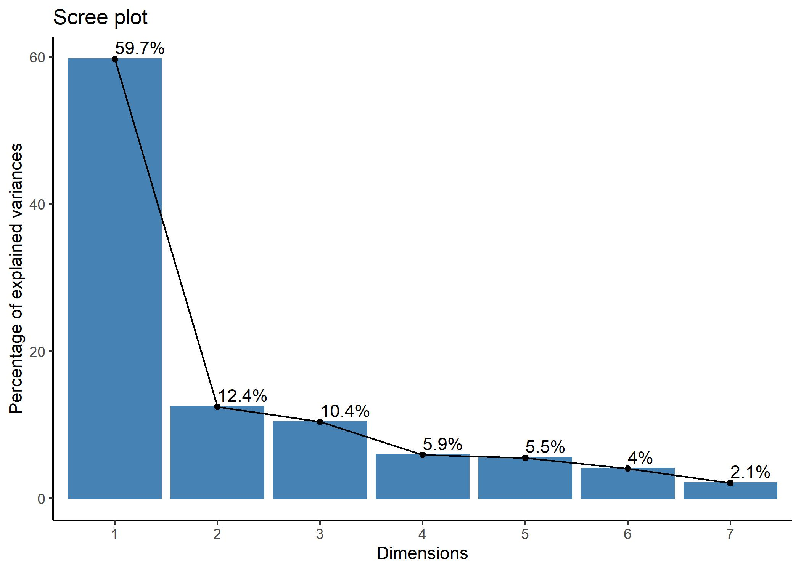
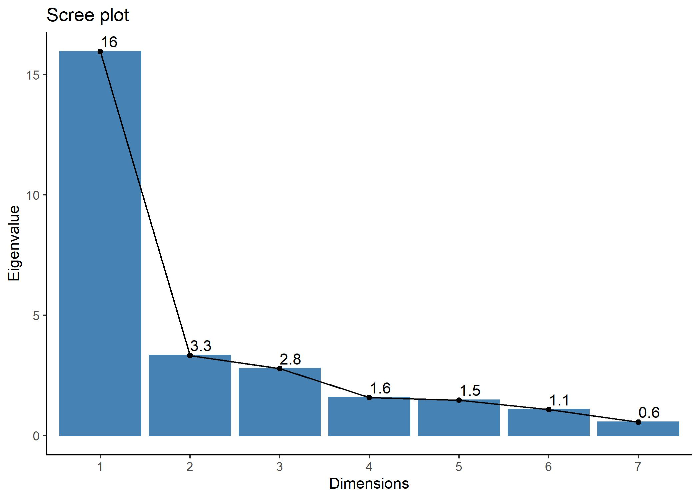
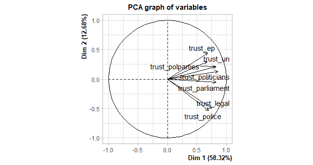

R fordypningsseminar 3: Faktoranalyse
================

La oss tenke oss at våre tillitsvariabler sammen måler et (eller flere) underliggende konsep – for eksempel politisk tillit.

``` r
## HUSK install.packages("pakkenavn") FØRST OM DU IKKE HAR BRUKT PAKKEN FØR ##
library(psych) # Nyttig for faktoranalyse
```

    ## Warning: package 'psych' was built under R version 3.5.3

``` r
library(tidyverse) # Dataprepping e.l.
```

    ## Warning: package 'tidyverse' was built under R version 3.5.3

    ## -- Attaching packages ------------------------------------------- tidyverse 1.3.0 --

    ## v ggplot2 3.3.2     v purrr   0.3.4
    ## v tibble  3.0.1     v dplyr   1.0.0
    ## v tidyr   1.1.0     v stringr 1.4.0
    ## v readr   1.3.1     v forcats 0.5.0

    ## Warning: package 'tibble' was built under R version 3.5.3

    ## Warning: package 'readr' was built under R version 3.5.3

    ## Warning: package 'purrr' was built under R version 3.5.3

    ## Warning: package 'stringr' was built under R version 3.5.3

    ## Warning: package 'forcats' was built under R version 3.5.3

    ## -- Conflicts ---------------------------------------------- tidyverse_conflicts() --
    ## x ggplot2::%+%()   masks psych::%+%()
    ## x ggplot2::alpha() masks psych::alpha()
    ## x dplyr::filter()  masks stats::filter()
    ## x dplyr::lag()     masks stats::lag()

``` r
library(sjlabelled) # Undersøke labels
```

    ## 
    ## Attaching package: 'sjlabelled'

    ## The following object is masked from 'package:forcats':
    ## 
    ##     as_factor

    ## The following object is masked from 'package:dplyr':
    ## 
    ##     as_label

``` r
library(REdaS) # For å gjøre Bartletts test
```

    ## Warning: package 'REdaS' was built under R version 3.5.3

    ## Loading required package: grid

``` r
library(FactoMineR) # Alternativ pakke for faktoranalyse
```

    ## Warning: package 'FactoMineR' was built under R version 3.5.3

``` r
library(factoextra) # Litt mer intuitive varianter av. bla scree plot
```

    ## Warning: package 'factoextra' was built under R version 3.5.3

    ## Welcome! Want to learn more? See two factoextra-related books at https://goo.gl/ve3WBa

``` r
library(GPArotation) # For rotasjon
```

    ## Warning: package 'GPArotation' was built under R version 3.5.2

``` r
library(ggcorrplot) # For korrelasjonsplot
```

    ## Warning: package 'ggcorrplot' was built under R version 3.5.3

``` r
library(stargazer)
```

    ## 
    ## Please cite as:

    ##  Hlavac, Marek (2018). stargazer: Well-Formatted Regression and Summary Statistics Tables.

    ##  R package version 5.2.2. https://CRAN.R-project.org/package=stargazer

``` r
## Start med data fra European Social Survey bare for norge (ess9no). 
## Last ned fra data-mappen på github, lagre data i prosjektmappen din (working ## directory) og kjør den nødvendige koden for å laste inn data (funksjonen
## avhenger av filtypen du valgte). Jeg laster inn .Rdata:

load("../data/ess9no.Rdata")
```

Steg 1: Forberede data
----------------------

Det første vi gjør er å kontrollere data. Hvilket målenivå har variablene? Går skalene i samme retning? For å undersøke dette kan vi begynne med litt deksriptiv statistikk:

``` r
ess_no %>%
  select(starts_with("trust")) %>% 
  summary()
```

    ##   trust_legal      trust_police    trust_politicians    trust_ep     
    ##  Min.   : 0.000   Min.   : 0.000   Min.   : 0.00     Min.   : 0.000  
    ##  1st Qu.: 7.000   1st Qu.: 7.000   1st Qu.: 4.00     1st Qu.: 4.000  
    ##  Median : 8.000   Median : 8.000   Median : 5.00     Median : 6.000  
    ##  Mean   : 7.513   Mean   : 7.627   Mean   : 5.28     Mean   : 5.453  
    ##  3rd Qu.: 9.000   3rd Qu.: 9.000   3rd Qu.: 7.00     3rd Qu.: 7.000  
    ##  Max.   :10.000   Max.   :10.000   Max.   :10.00     Max.   :10.000  
    ##  NA's   :22       NA's   :3        NA's   :8         NA's   :266     
    ##     trust_un      trust_polparties trust_parliament
    ##  Min.   : 0.000   Min.   : 0.000   Min.   : 0.000  
    ##  1st Qu.: 6.000   1st Qu.: 4.000   1st Qu.: 6.000  
    ##  Median : 7.000   Median : 6.000   Median : 7.000  
    ##  Mean   : 6.957   Mean   : 5.401   Mean   : 6.755  
    ##  3rd Qu.: 8.000   3rd Qu.: 7.000   3rd Qu.: 8.000  
    ##  Max.   :10.000   Max.   :10.000   Max.   :10.000  
    ##  NA's   :37       NA's   :12       NA's   :6

``` r
# Undersøker missing-verdier
table(complete.cases(ess_no))
```

    ## 
    ## FALSE  TRUE 
    ##   387  1019

Dersom vi har labelled data så kan vi bruke pakken `sjlabelled` til å se nærmere på retningen på variabler. Om ikke er kodeboken alltid en viktig ressurs i dette arbeidet.

``` r
summary(ess_no$trust_police)
```

    ##    Min. 1st Qu.  Median    Mean 3rd Qu.    Max.    NA's 
    ##   0.000   7.000   8.000   7.627   9.000  10.000       3

``` r
get_labels(ess_no$trust_police)
```

    ##  [1] "No trust at all" "1"               "2"               "3"              
    ##  [5] "4"               "5"               "6"               "7"              
    ##  [9] "8"               "9"               "Complete trust"

Det neste vi vil gjøre er å bare sjekke korrelasjonen mellom disse variablene. Jeg bruker `cor.plot()` for å visualisere kjapt hvordan korrelasjonsmatrisen ser ut. Vi kunne brukt `ggplot()` også her, men det tar litt lenger tid (når dere skriver oppgaver: pass på å gjøre figurer/tabeller finere enn dette). Et alternativ som jeg viser under er å bruke pakken `ggcorrplot` som bygger på `ggplot`, men gir oss noen snarveier.

``` r
korrel <- ess_no %>%
  select(starts_with("trust")) %>%
  cor(, use = "complete.obs")
korrel
```

    ##                   trust_legal trust_police trust_politicians  trust_ep
    ## trust_legal         1.0000000    0.6704908         0.4963034 0.4130454
    ## trust_police        0.6704908    1.0000000         0.4850260 0.3758577
    ## trust_politicians   0.4963034    0.4850260         1.0000000 0.5858923
    ## trust_ep            0.4130454    0.3758577         0.5858923 1.0000000
    ## trust_un            0.3930828    0.4057201         0.4679289 0.5971726
    ## trust_polparties    0.4491948    0.3982658         0.8343441 0.5757548
    ## trust_parliament    0.5871948    0.4969593         0.6984298 0.5249233
    ##                    trust_un trust_polparties trust_parliament
    ## trust_legal       0.3930828        0.4491948        0.5871948
    ## trust_police      0.4057201        0.3982658        0.4969593
    ## trust_politicians 0.4679289        0.8343441        0.6984298
    ## trust_ep          0.5971726        0.5757548        0.5249233
    ## trust_un          1.0000000        0.4445117        0.4569230
    ## trust_polparties  0.4445117        1.0000000        0.6520929
    ## trust_parliament  0.4569230        0.6520929        1.0000000

``` r
# Plotter korrelasjon:
cor.plot(korrel, numbers = TRUE)
```



Alternativ metode ved hjelp av ggcorrplot som tar utgangspunkt i ggplot fra pakken `ggcorrplot`:

``` r
ggcorrplot(korrel, show.diag = FALSE, lab = TRUE,
           hc.order =  TRUE, type = "upper",
           ggtheme = theme_void())
```



Vi kan også kjøre en slå opp Kaiser, Meyer, Olkin Measure of Sampling Adequacy ved hjelp av funksjonen `KMO()` i pakken psych, og ta en Bartletts test ved hjelp av funksjonen `bart_spher` i REdaS-pakken.

``` r
KMO(korrel) 
```

    ## Kaiser-Meyer-Olkin factor adequacy
    ## Call: KMO(r = korrel)
    ## Overall MSA =  0.84
    ## MSA for each item = 
    ##       trust_legal      trust_police trust_politicians          trust_ep 
    ##              0.82              0.82              0.81              0.88 
    ##          trust_un  trust_polparties  trust_parliament 
    ##              0.87              0.81              0.92

``` r
bart_spher(korrel)
```

    ##  Bartlett's Test of Sphericity
    ## 
    ## Call: bart_spher(x = korrel)
    ## 
    ##      X2 = 112.507
    ##      df = 21
    ## p-value < 2.22e-16

KMO måler i hvilken grad hver variabel i analysen kan predikeres uten målefeil av de andre variablene. Vi ønsker at "overall MSA" skal være minst 0.5. Samtidig ønsker vi en signifikant Bartletts test. Bartletts test kan imidlertid også bli signifikant selv om KMO-verdiene ikke er høye nok.

Korrelasjonene er altså ganskehøye mellom alle variablene – de laveste er rundt 0.40. I tillegg har vi en KMO-verdi på godt over 0.5 og en signifikant Bartletts test. La oss kjøre på med faktoranalysene. Vi gjør først en prinsipal komponentanalyse. Denne er eksplorerende, i at vi ikke bestemmer på forhånd hvor mange faktorer variablene deler seg inn i. Funksjonen vi bruker er princomp(), som kan spesifiseres på flere måter. Jeg har lagt opp en formel som sier at vi skal bruke alle variablene i data-argumentet (ess) – her trekker jeg (som i korrelasjonene over) ut bare trust-variablene. Jeg tar også vare på scores.

``` r
trust_prin <- princomp(~.,    # Her skal vi ha en formel uten AVAR. Med "." sier vi at vi vil ta med alt i datasettet
                       ess_no %>%
                         select(starts_with("trust")),
                       scores = TRUE, na.action = "na.omit")

loadings(trust_prin)
```

    ## 
    ## Loadings:
    ##                   Comp.1 Comp.2 Comp.3 Comp.4 Comp.5 Comp.6 Comp.7
    ## trust_legal        0.340  0.540  0.143  0.153  0.241  0.698       
    ## trust_police       0.324  0.575  0.262  0.142 -0.421 -0.532 -0.123
    ## trust_politicians  0.413 -0.116 -0.405        -0.357         0.723
    ## trust_ep           0.409 -0.476  0.304  0.669  0.228 -0.119       
    ## trust_un           0.337 -0.296  0.610 -0.628 -0.133  0.122       
    ## trust_polparties   0.377 -0.195 -0.429        -0.353  0.240 -0.673
    ## trust_parliament   0.431  0.107 -0.314 -0.338  0.665 -0.377       
    ## 
    ##                Comp.1 Comp.2 Comp.3 Comp.4 Comp.5 Comp.6 Comp.7
    ## SS loadings     1.000  1.000  1.000  1.000  1.000  1.000  1.000
    ## Proportion Var  0.143  0.143  0.143  0.143  0.143  0.143  0.143
    ## Cumulative Var  0.143  0.286  0.429  0.571  0.714  0.857  1.000

Ladningene vist under, viser ikke veldig sterke mønster (for meg hvertfall). Legg merke til at denne type faktoranalyse går fra 1 faktor til antall variabler du putter inn (her 7). Heldigvis finnes det andre hjelpemidler vi kan ta i bruke for å vurdere hvor mange faktorer vi bør velge.

### Kaisers kriterium

Kaisers kriterium tar utgangspunkt i eigenvalues og sier at de faktorene som har eigenvalue større enn eller lik 1, skal tas med. Vi kan hente ut eigenvalues til korrelasjonsmatrisen ved hjelp av `eigen`.

``` r
eigen <- eigen(korrel)
names(eigen)
```

    ## [1] "values"  "vectors"

``` r
# Summen av alle eigen-verdiene er lik antall indikatorer:
sum(eigen$values)
```

    ## [1] 7

``` r
# Henter ut eigen-verdiene
eigen$values
```

    ## [1] 4.1689218 0.8978463 0.7273028 0.3789470 0.3779657 0.2919924 0.1570240

### Andel forklart varians

Vi kan sette oss et mål om at vi ved hjelp av faktorene våre skal forklare en viss prosentandel av variansen i indikatorene våre. Da må vi hente ut informasjon om kumulativ forklart varians til faktorene.

``` r
## Kumulativ forklart varians kan hentes ut herfra:
summary(trust_prin)
```

    ## Importance of components:
    ##                           Comp.1    Comp.2    Comp.3     Comp.4     Comp.5
    ## Standard deviation     3.9947012 1.8222568 1.6664687 1.25525772 1.21133068
    ## Proportion of Variance 0.5968747 0.1242035 0.1038745 0.05893596 0.05488327
    ## Cumulative Proportion  0.5968747 0.7210782 0.8249527 0.88388863 0.93877191
    ##                            Comp.6     Comp.7
    ## Standard deviation     1.03747087 0.74873693
    ## Proportion of Variance 0.04025932 0.02096878
    ## Cumulative Proportion  0.97903122 1.00000000

``` r
# Eller plottes:
fviz_screeplot(trust_prin,
               addlabels = TRUE) +
  theme_classic()
```



### Scree-test

Et tredje alternativ er å bruke et Scree-plot. Tanken bak et scree-plot er å illustrere hvor den unike variansen blir dominerende, altså den variansen variablene ikke deler med hverandre. Den blir dominerende når eigenverdien flater ut i plottet.

``` r
screeplot(trust_prin, type = "lines")
```


``` r
fviz_screeplot(trust_prin,
               addlabels = TRUE,
               choice = "eigenvalue") +
  theme_classic()
```



Ser vi på screeplotet derimot, er det tydelig at èn faktor forklarer mye. Likevel kan vi ikke ignorere faktor 2 og 3 heller.

Faktoranalyse med bestemt antall faktorer
-----------------------------------------

Vi kan ha en ganske tydelig, men uhøytidelig, teoretisk antagelse om hvorfor våre variabler deler seg i tre faktorer:

-   en faktor handler om nasjonal politikk (parlament, politiske partier, politikere)
-   en faktor handler om rettsvesen (rettssystem,politi)
-   en faktor handler om internasjonale institusjoner (EU, FN).

Videre så skal vi bruke vi funksjonen factanal() som er satt opp ganske likt som princomp(). Forskjellen er at vi setter akkurat hvor mange faktorer vi skal ha i analysen (3).

``` r
trust_factor3 <- factanal(~., 3, ess_no %>%
                            select(starts_with("trust")))

names(trust_factor3)
```

    ##  [1] "converged"    "loadings"     "uniquenesses" "correlation"  "criteria"    
    ##  [6] "factors"      "dof"          "method"       "rotmat"       "na.action"   
    ## [11] "STATISTIC"    "PVAL"         "n.obs"        "call"

Faktorobjektet inneholder informasjon om blant annet variablene/indikatorenes lading på de ulike faktorene og uniqueness (den delen av variansen til variablene som ikke er felles).

Faktorladningene kan vi hente ut ved hjelp av denne funksjonen. Her sier jeg at jeg bare vil vise faktorladninger som er høyere enn 0.4.

``` r
print(loadings(trust_factor3), cutoff = .4)
```

    ## 
    ## Loadings:
    ##                   Factor1 Factor2 Factor3
    ## trust_legal               0.886          
    ## trust_police              0.645          
    ## trust_politicians 0.863                  
    ## trust_ep          0.496           0.449  
    ## trust_un                          0.943  
    ## trust_polparties  0.840                  
    ## trust_parliament  0.601   0.455          
    ## 
    ##                Factor1 Factor2 Factor3
    ## SS loadings      2.251   1.653   1.296
    ## Proportion Var   0.322   0.236   0.185
    ## Cumulative Var   0.322   0.558   0.743

Fra faktorbjektet kan vi også hente ut uniqueness.

``` r
trust_factor3$uniquenesses
```

    ##       trust_legal      trust_police trust_politicians          trust_ep 
    ##         0.1318668         0.4647931         0.1284413         0.4900075 
    ##          trust_un  trust_polparties  trust_parliament 
    ##         0.0050000         0.1997903         0.3805800

Dersom du ønsker en tabell med både faktorladinger og uniqueness så kan det enkelt kombineres. Her lagrer jeg elementene jeg vil hente ut i et objekt og bruker `stargazer()` til å printe en tabell.

``` r
uniqueness <- cbind(trust_factor3$loadings, 
                    Uniqueness = trust_factor3$uniquenesses)

stargazer::stargazer(uniqueness, type = "text")
```

    ## 
    ## ====================================================
    ##                   Factor1 Factor2 Factor3 Uniqueness
    ## ----------------------------------------------------
    ## trust_legal        0.248   0.886   0.150    0.132   
    ## trust_police       0.274   0.645   0.212    0.465   
    ## trust_politicians  0.863   0.288   0.210    0.128   
    ## trust_ep           0.496   0.249   0.449    0.490   
    ## trust_un           0.241   0.217   0.943    0.005   
    ## trust_polparties   0.840   0.232   0.204    0.200   
    ## trust_parliament   0.601   0.455   0.226    0.381   
    ## ----------------------------------------------------

Rotasjon
--------

For å gjøre faktorene lettere å tolke kan vi bruke rotasjon. Her kommer noen eksempler på ulike typer rotasjon. Rotasjon påvirker ladningen til indikatorene/variablene på de ulike faktorene. Når vi roterer så omfordeler vi varians mellom faktorene.

### Ortogonal rotasjon

Ved ortogonal rotasjon forbli faktorene ukorrelerte.

``` r
# Ortogonal rotasjon (ikke korrelert)
varimax(loadings(trust_factor3), normalize = TRUE)
```

    ## $loadings
    ## 
    ## Loadings:
    ##                   Factor1 Factor2 Factor3
    ## trust_legal       0.248   0.886   0.150  
    ## trust_police      0.274   0.644   0.212  
    ## trust_politicians 0.863   0.287   0.210  
    ## trust_ep          0.496   0.249   0.449  
    ## trust_un          0.241   0.217   0.943  
    ## trust_polparties  0.840   0.232   0.204  
    ## trust_parliament  0.601   0.455   0.226  
    ## 
    ##                Factor1 Factor2 Factor3
    ## SS loadings      2.252   1.652   1.296
    ## Proportion Var   0.322   0.236   0.185
    ## Cumulative Var   0.322   0.558   0.743
    ## 
    ## $rotmat
    ##              [,1]          [,2]          [,3]
    ## [1,] 0.9999999454 -0.0003195526 -8.382791e-05
    ## [2,] 0.0003195650  0.9999999381  1.470854e-04
    ## [3,] 0.0000837809 -0.0001471122  1.000000e+00

``` r
# Hver indikator lader enten høyt eller lavt på en faktor, 
# men kan lade høyt/lavt på flere faktorer

quartimax(loadings(trust_factor3), normalize = TRUE)
```

    ## Orthogonal rotation method Quartimax converged.
    ## Loadings:
    ##                   Factor1 Factor2  Factor3
    ## trust_legal         0.599  0.7134  0.00899
    ## trust_police        0.548  0.4781  0.07745
    ## trust_politicians   0.928 -0.0774 -0.07248
    ## trust_ep            0.663  0.0160  0.26588
    ## trust_un            0.573  0.0593  0.81430
    ## trust_polparties    0.884 -0.1191 -0.06754
    ## trust_parliament    0.767  0.1769  0.00861
    ## 
    ## Rotating matrix:
    ##       [,1]    [,2]    [,3]
    ## [1,] 0.876 -0.3844 -0.2927
    ## [2,] 0.382  0.9218 -0.0691
    ## [3,] 0.296 -0.0512  0.9537

``` r
# Hver indikator lader høyt på bare en faktor, men kan lade
# moderat også på andre
```

### Oblique rotasjon

Ved oblique rotasjon så tillater vi at faktorene korrelrer seg imellom.

``` r
# Oblique (korrelert)
oblimin(loadings(trust_factor3))
```

    ## Oblique rotation method Oblimin Quartimin converged.
    ## Loadings:
    ##                   Factor1  Factor2  Factor3
    ## trust_legal       -0.0202  0.95111 -0.01779
    ## trust_police       0.0757  0.64138  0.08350
    ## trust_politicians  0.9309  0.01401 -0.01092
    ## trust_ep           0.4238  0.04711  0.36209
    ## trust_un          -0.0112  0.00227  1.00223
    ## trust_polparties   0.9213 -0.04334 -0.00402
    ## trust_parliament   0.5436  0.30054  0.04803
    ## 
    ## Rotating matrix:
    ##        [,1]   [,2]   [,3]
    ## [1,]  1.250 -0.338 -0.245
    ## [2,] -0.330  1.200 -0.147
    ## [3,] -0.255 -0.188  1.159
    ## 
    ## Phi:
    ##       [,1]  [,2]  [,3]
    ## [1,] 1.000 0.586 0.516
    ## [2,] 0.586 1.000 0.446
    ## [3,] 0.516 0.446 1.000

``` r
promax(loadings(trust_factor3))
```

    ## $loadings
    ## 
    ## Loadings:
    ##                   Factor1 Factor2 Factor3
    ## trust_legal                1.024         
    ## trust_police               0.681         
    ## trust_politicians  1.003                 
    ## trust_ep           0.416           0.362 
    ## trust_un          -0.113           1.086 
    ## trust_polparties   0.997                 
    ## trust_parliament   0.556   0.291         
    ## 
    ##                Factor1 Factor2 Factor3
    ## SS loadings      2.505   1.609   1.327
    ## Proportion Var   0.358   0.230   0.190
    ## Cumulative Var   0.358   0.588   0.777
    ## 
    ## $rotmat
    ##            [,1]       [,2]       [,3]
    ## [1,]  1.3998913 -0.4211349 -0.3362696
    ## [2,] -0.4387336  1.3135121 -0.1837553
    ## [3,] -0.3763168 -0.2358856  1.2794202

For å få en oversikt over mulige rotasjonmuligheter så kan du skrive `?quartimax`.

Opprette indekser
-----------------

Målet med faktoranalyse er ofte å kunne oppsumere flere variabler/indikatorer i færre faktorer. Det siste vi gjør er derfor å opprette indekser.

### Additive indekser

Det finnes mange muligheter for additive indekser, og her vises bare et eksempel der hver variabel er vektet like mye.

``` r
ess_no$political_trust <- (ess_no$trust_parliament + ess_no$trust_politicians + ess_no$trust_polparties) / 3
ess_no$legal_trust <- (ess_no$trust_legal + ess_no$trust_police) / 2
ess_no$international_trust <- (ess_no$trust_un + ess_no$trust_ep) / 2
```

### Faktorskårer

Et alternativ til å la hver variabel/indikator veie like mye er å bruke faktorskårer som vekter variablenes verdi ihht ladningen på faktoren. For å hente ut faktorskårer så bruker jeg `factanal()` en gang til, men denne gangen spesifiserer jeg `scores = "regression`. En kan velge mellom regression og Bartlett, men her må dere undersøke nærmere selv eller spørre foreleser hva som gir mest mening.

``` r
## Opprette faktorindekser
trust_factor3score <- factanal(~., 3, ess_no %>%
                            select(starts_with("trust")),
                          scores = "regression", # Her kan vi velge mellom regression og Bartlett
                          na.action = "na.exclude")

loadings(trust_factor3score)
```

    ## 
    ## Loadings:
    ##                   Factor1 Factor2 Factor3
    ## trust_legal       0.248   0.886   0.150  
    ## trust_police      0.274   0.645   0.212  
    ## trust_politicians 0.863   0.288   0.210  
    ## trust_ep          0.496   0.249   0.449  
    ## trust_un          0.241   0.217   0.943  
    ## trust_polparties  0.840   0.232   0.204  
    ## trust_parliament  0.601   0.455   0.226  
    ## 
    ##                Factor1 Factor2 Factor3
    ## SS loadings      2.251   1.653   1.296
    ## Proportion Var   0.322   0.236   0.185
    ## Cumulative Var   0.322   0.558   0.743

``` r
# Ser hva som er lagret i modellen:
names(trust_factor3score)
```

    ##  [1] "converged"    "loadings"     "uniquenesses" "correlation"  "criteria"    
    ##  [6] "factors"      "dof"          "method"       "rotmat"       "na.action"   
    ## [11] "scores"       "STATISTIC"    "PVAL"         "n.obs"        "call"

``` r
# Sjekker ut de fem første radene i scores-elementet
trust_factor3score$scores[1:5, ]
```

    ##      Factor1    Factor2    Factor3
    ## 1  0.2962564  0.6086857 -2.8906546
    ## 2  1.0333194 -0.5394335 -0.1118756
    ## 3         NA         NA         NA
    ## 4 -0.5817877 -3.3533432 -1.2234151
    ## 5  1.2060801  0.4071600  0.7081771

``` r
# Lagrer faktor-skår i data
# Husk na.action = "na.exclude" i modellen over.
ess_no$politicaltrust_score <- trust_factor3score$scores[, 1]
ess_no$legaltrust_score <- trust_factor3score$scores[, 2]
ess_no$inttrust_score <- trust_factor3score$scores[, 3]
summary(ess_no$politicaltrust_score)
```

    ##    Min. 1st Qu.  Median    Mean 3rd Qu.    Max.    NA's 
    ## -3.6019 -0.5427  0.1045  0.0000  0.6662  2.8939     287

``` r
summary(ess_no$legaltrust_score)
```

    ##    Min. 1st Qu.  Median    Mean 3rd Qu.    Max.    NA's 
    ## -4.1668 -0.4567  0.1598  0.0000  0.6433  1.8300     287

``` r
cor(ess_no$trust_legal, ess_no$legaltrust_score, use = "complete") 
```

    ## [1] 0.9639173

``` r
cor(ess_no$trust_polparties, ess_no$legaltrust_score, use = "complete")
```

    ## [1] 0.2527537

Bonus
-----

Alternativ kode i pakken FactoMineR som gir et interessant plot:

``` r
trust_prin_alt <- PCA(ess_no%>%
                        select(starts_with("trust")))
```

    ## Warning in PCA(ess_no %>% select(starts_with("trust"))): Missing values are
    ## imputed by the mean of the variable: you should use the imputePCA function of
    ## the missMDA package


``` r
## OBS!! Merk dere advarselen som kommer når dere kjører denne koden og har missing i datasettet .. 
```



Gå evnt. gjennom den gratis introen i web-kurset [Dimensionality reduction in R på Datacamp](https://learn.datacamp.com/courses/dimensionality-reduction-in-r) for innsikt i hvordan det kan tolkes.
